

  <!-- animation gif -->
   
  <h1>Access control app/h1>

- [x] - Dark mode
- [x] - Login page
- [ ] - Consume an API
- [ ] - Create to remaining screens
- [ ] - Using shortcuts apple

  <a href="#rocket-technologies">Technologies</a>

- Dark Mode

  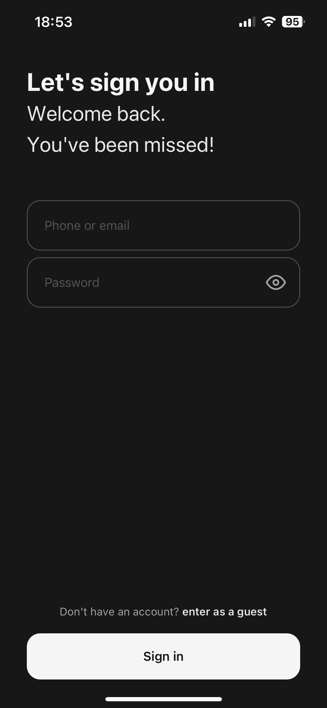 
  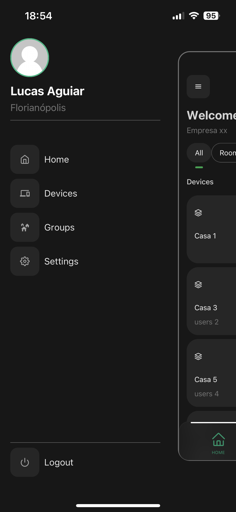
  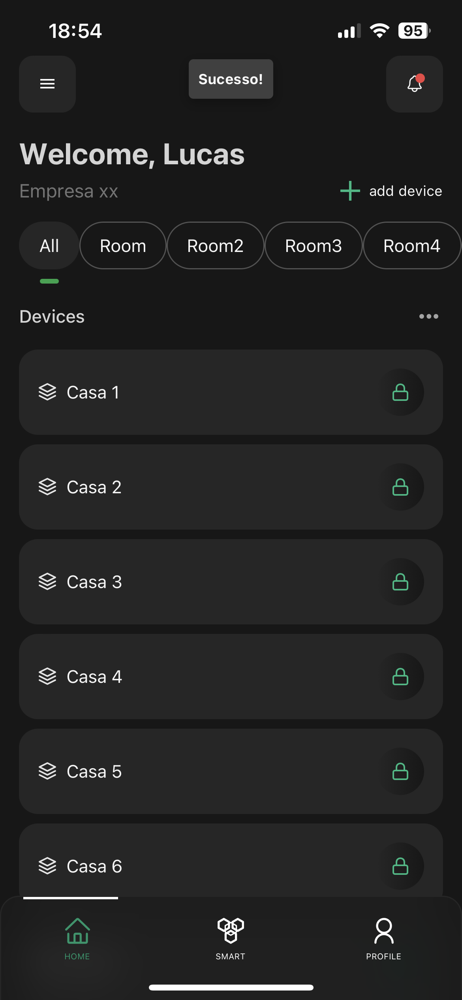 
  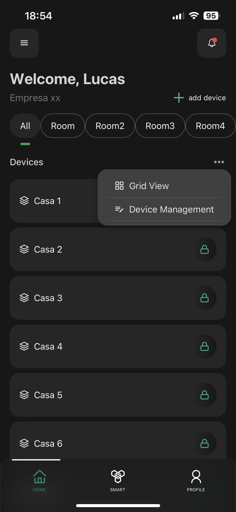
  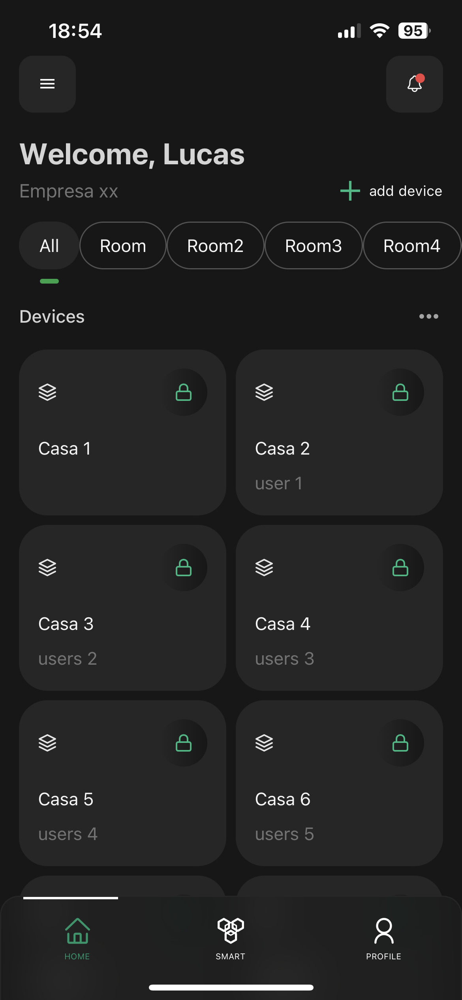
  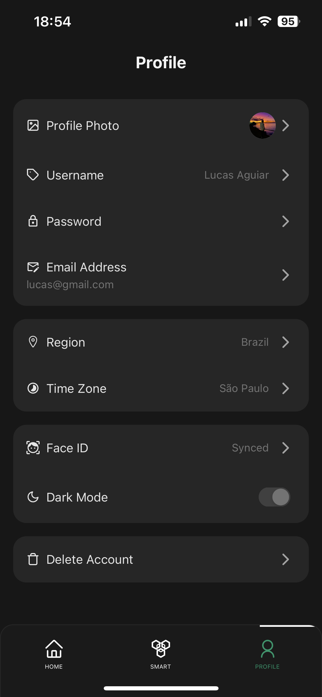
  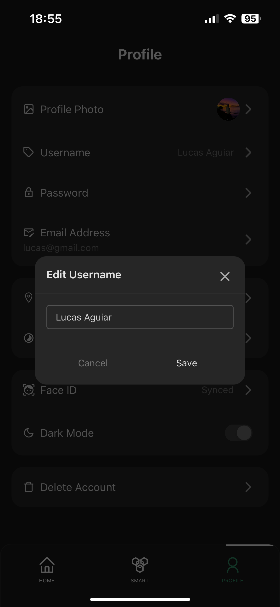
  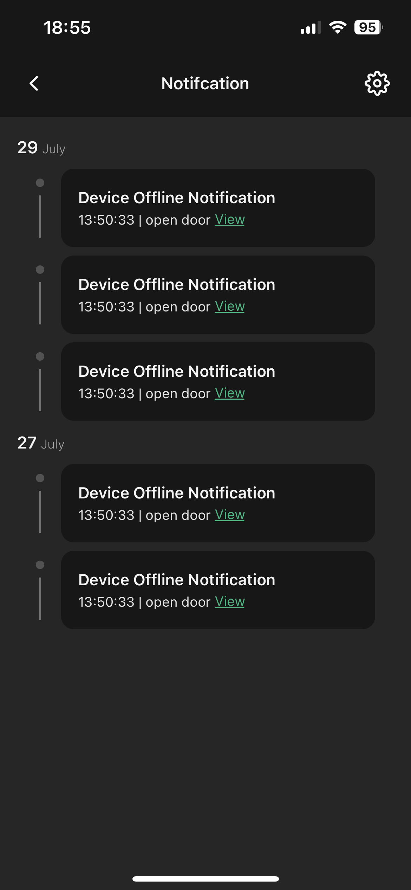

 

- Light Mode

   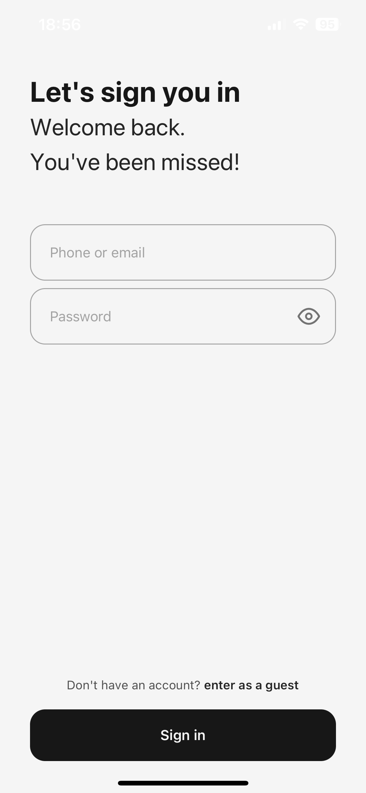
   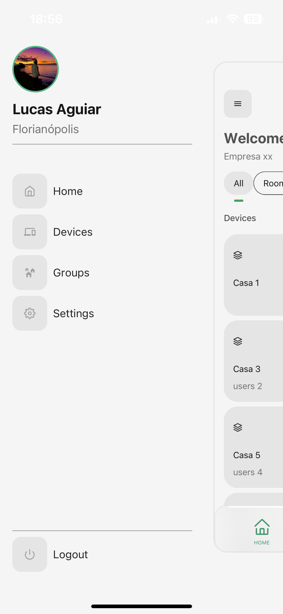
   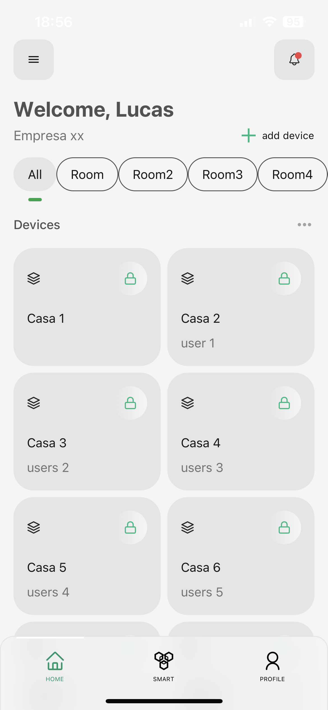
   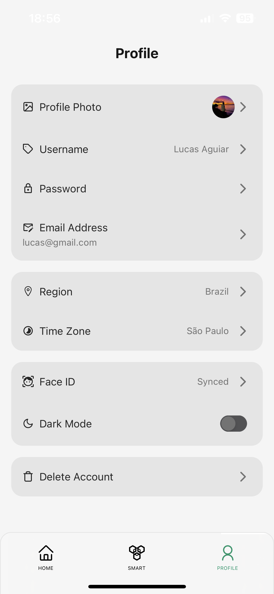

---

## :rocket: Technologies

- [React](https://reactjs.org/)
- [Typescript](https://www.typescriptlang.org)
- [tailwind](https://tailwindcss.com/)
- [Material UI](https://mui.com/)

---

Made with ♥ by Lucas Aguiar :wave: [Get in touch!](https://www.linkedin.com/in/lucasaguiiar)
